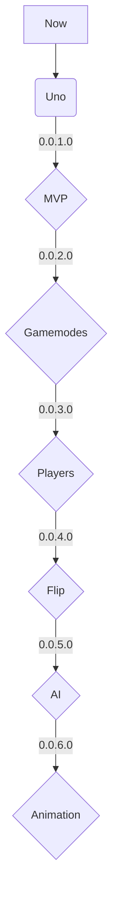

# uno
This is where my uno code goes

```mermaid
graph TD;
    A[Now]-->B(Uno);
    B --> |0.0.1.0| C{MVP};
    C --> |0.0.2.0| D{Gamemodes};
    D --> |0.0.3.0| E{Players};
    E --> |0.0.4.0| F{Flip};
    F --> |0.0.5.0| G{AI};
    G --> |0.0.6.0| H{Animation};
```
